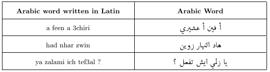

# DSAraby
We've created a library named "DSAraby" that aims to transliterate text which write a word using the closest corresponding letters of a different alphabet or language. The algorithm gives the possible words in Arabic based on a given word in Latin by mapping Latin letters to Arabic ones, then takes the most frequent word existing in a corpus.

## Example

## How to use it ?
<code>
  from dsaraby import DSAraby
 </code>
 <code>
  ds = DSAraby()
</code>
<code>
  w = ds.transliterate('chokran likom kamliin')
</code>
<code>
  print(w)
  
</code>
